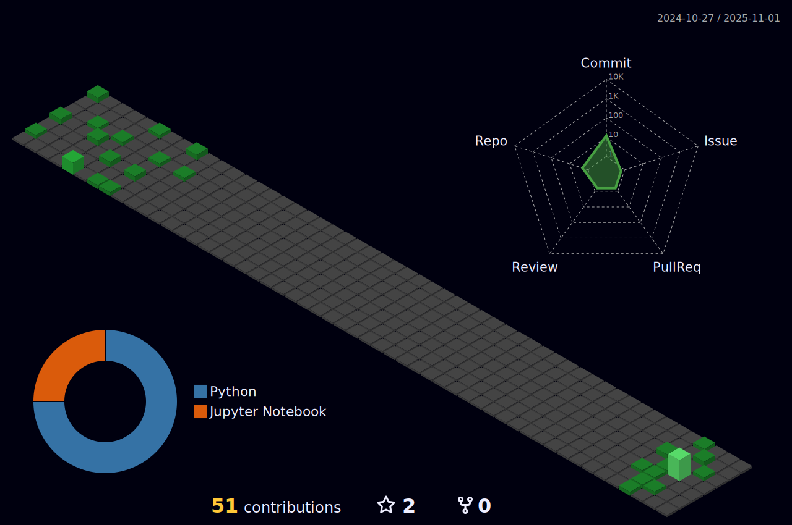

Welcome to My Datafreak World!
Hey folks! This is Lucas Oliveira, an relentless explorer of the data world and an enthusiast of the craziest technologies you can imagine.

🚀 My Datafreak Journey: With a journey that started way back when Delphi was the coolest thing around, I've been through wild projects ranging from security systems for the elderly to forest fire analysis. Amidst all the madness, I've explored tools like Python, Django, AWS, Redshift, Pyspark, and others that allowed me to venture into the vast universe of data.

💡 Objective of My GitHub: This is my personal space to share the craziness that runs through my mind. Here, you'll find wild scripts, outlandish ideas, absurd APIs, and projects that defy the bounds of logic and reason. But that's not all! I'm also on a mission to contribute to sustainability projects and those with a larger purpose, because I believe that the power of data can make a difference in the world.

📫 How to reach me: Drop me an email at luk14236@gmail.com or connect with me on LinkedIn: linkedin.com/in/luk1.

